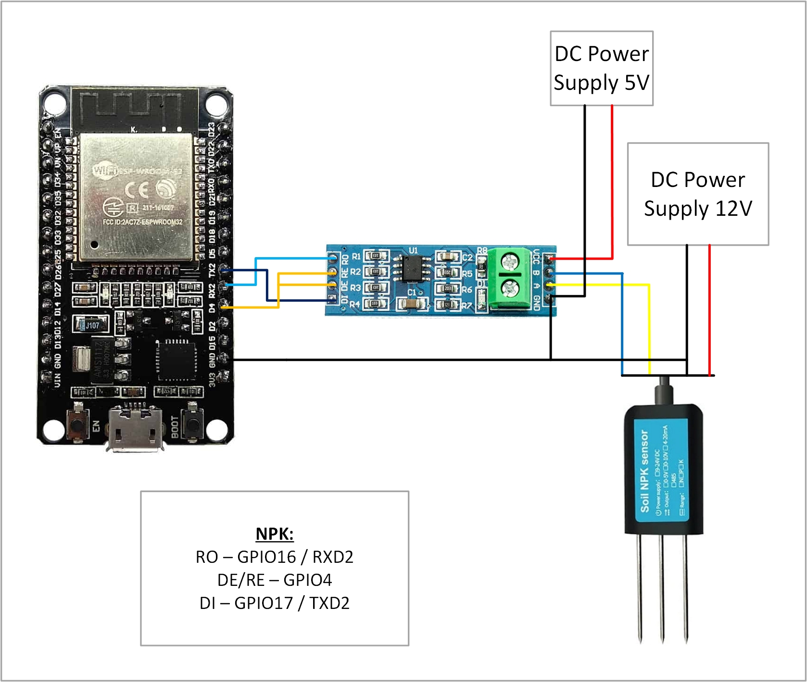
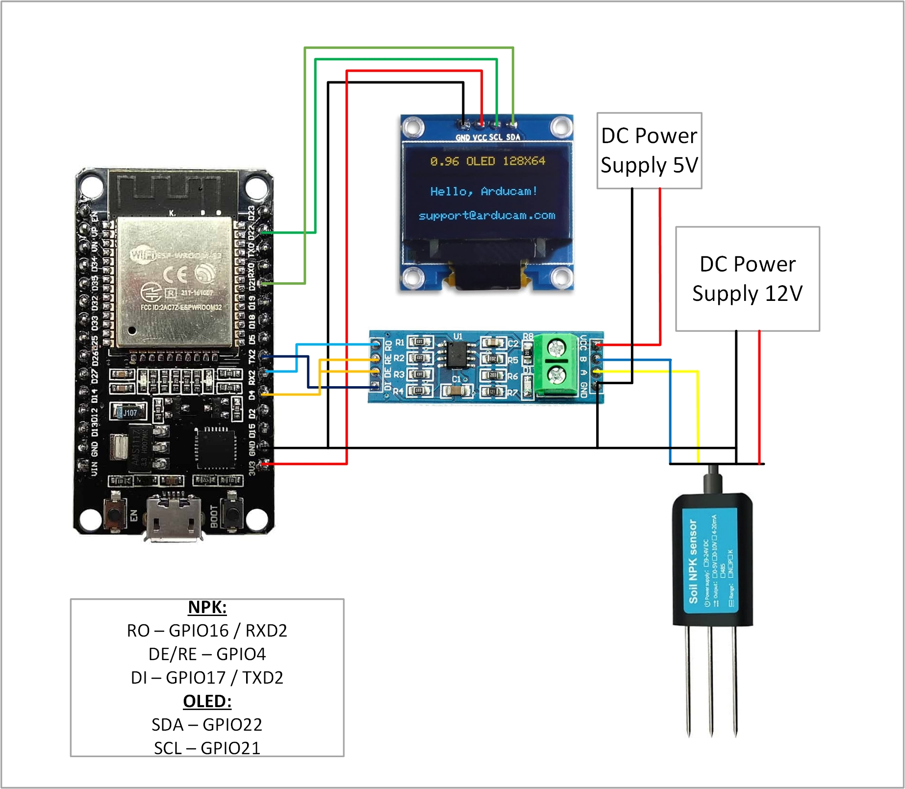

# Pcb-dev
This repo is for PCB development

## Use NPK Sensor with ESP32
 - First connect the NPK Sensor with ESP32 using MAX485 TTL To RS485 Module as shown in the image below.
 - Make sure the MAX485 module is properly powered. Some modules can be used on 3.3V, however, most of the modules require 5V.
 - Use a 12V / 24V DC adapter to power the NPK Sensor.
 - Add the ModbusMaster library from Doc Walker in Arduino IDE. It can be directly downloaded to Arduino IDE from Library Manager or can be accessed from "https://github.com/4-20ma/ModbusMaster".
 - Upload the code from "NPK.ino"

## Use NPK Sensor with ESP32 and display results on OLED
- Connect the NPK Sensor, OLED and ESP32 as per the wiring scheme shown below.

- Use a 12V / 24V DC adapter to power NPK Sensor.
- Add the ModbusMaster library from Doc Walker in Arduino IDE.
- Add the Adafruit_SSD1306 library and Adafruit_GFX library in Arduino IDE.
- Upload the code from "NPK_with_OLED.ino"