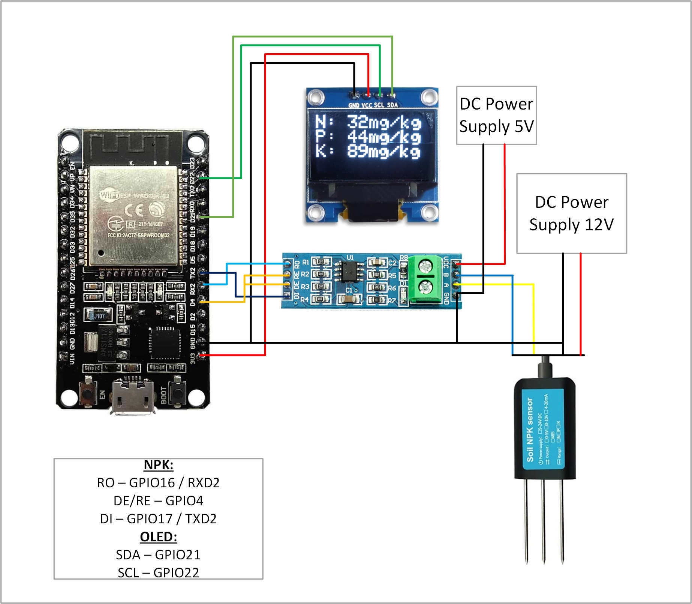

# Pcb-dev
This repo is for PCB development

## Using NPK Sensor with ESP32
 - First connect the NPK Sensor with ESP32 using MAX485 TTL To RS485 Module as shown in the image below.
 - Make sure the MAX485 module is properly powered. Some modules can be used on 3.3V, however, most of the modules require 5V.
 - Use a 12V / 24V DC adapter to power the NPK Sensor.
 - Add the ModbusMaster library from Doc Walker in Arduino IDE. It can be directly downloaded to Arduino IDE from Library Manager or can be accessed from "https://github.com/4-20ma/ModbusMaster".
 - Upload the code from "NPK.ino"

## Using NPK Sensor with ESP32 and display results on OLED
- Connect the NPK Sensor, OLED and ESP32 as per the wiring scheme shown below.

- Use a 12V / 24V DC adapter to power NPK Sensor.
- Add the ModbusMaster library from Doc Walker in Arduino IDE.
- Add the Adafruit_SSD1306 library and Adafruit_GFX library in Arduino IDE.
- Upload the code from "NPK_with_OLED.ino"

## Using TDS Sensor with ESP32
- Connect the TDS Sensor with ESP32 as shown in the figure below.

- Upload the code from "TDS_with_ESP32.ino"
- Calibrate the temperature.
- Select the baud rate as 115200 in the Arduino IDE.

## Using pH Sensor with ESP32
- First we need to calibrate the PCB module of the pH sensor.
- Connect the BNC pins to each other as shown in the figure below.

- Connect the PCB module with Arduino as shown as per the wiring scheme shown below.

- Upload the code from pH_calibration.ino
- Open the serial monitor and check the voltage. If you get 2.5V, then the PCB module is working perfectly. However, if you are receiving any other value, then use the potentiometer which is located above the BNC to get a proper result of 2.5V.
- Once the PCB module is calibrated, then remove the wire from the BNC connector and connect the pH sensor probe.
- Connect the pH sensor PCB module as per the wiring scheme shown below.

- Upload the code from "pH_Sensor_with_ESP32.ino"

## Using relay
- Connect the circuit as per the wiring diagram shown below.

- Instead of arduino, ESP32 can also be used. However make sure that the relay is powered accordingly from 5V source and check before applying the Mains supply.
- Upload the code from "Relay.ino"

## LED dimmer
- Two options -
    1. Using a 555 timer IC to generate a square wave along with a potentiometer that will vary the duty cycle (PWM). However, requires manual setting.
    2. Using the digital PWM pins to control the dimmer.

### Using 2.:
- Use a photoresistor as a light intensity sensor.
- Connect the photoresistor, diode and transistor BC547 as shown in the image below.

- Read the analog value obtained from photoresistor using Analog pins of Arduino.
- Use the code from "Light_sensor.ino".
- ### Carefully check the entire circuit befor turning on the 12V supply.
